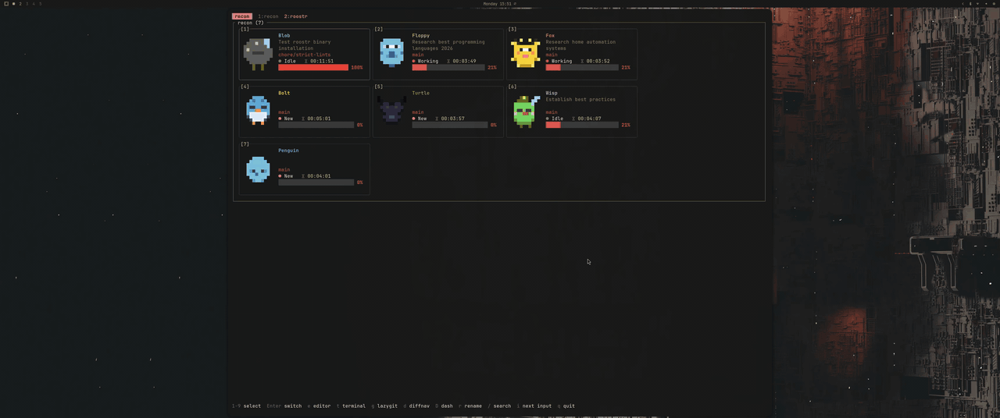
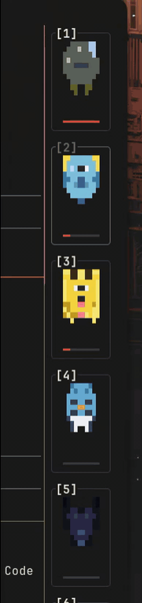

# roostr

A tmux-native dashboard for [Claude Code](https://claude.ai/claude-code) agents — a pixel-art creature for every session, all living in your terminal.

Each Claude Code instance becomes a sprite in a grouped room. Glance at the dashboard and instantly see who's working, who's blocked on input, and who's gone idle. Switch, kill, rename, or spawn sessions without leaving tmux.

## Demos

### Full dashboard



### Sidebar dock



The dock is a narrow tmux pane that auto-spawns on the right of every window. One mini-sprite per session with a context bar — same keybindings as the main view.

## How it works

roostr is a TUI that reads four data sources every 2 seconds and joins them:

```
tmux list-panes           → PID + tmux session name
~/.claude/sessions/{PID}  → JSONL session ID + startedAt
~/.claude/projects/*.jsonl → tokens, model, last activity
tmux capture-pane         → status (last line of pane)
```

Sessions are grouped into **rooms** by git repository — worktrees of the same repo share a room; monorepo sub-projects get their own (`myapp` vs `myapp › tools/cli`).

### Status detection

The status of each agent is derived from the Claude Code TUI status bar:

| Status bar text | State | Sprite |
|---|---|---|
| `esc to interrupt` | **Working** — streaming or running a tool | Happy blob, sparkles, feet (green) |
| `Esc to cancel` | **Input** — waiting for your approval | Angry blob, furrowed brows (orange, pulsing) |
| anything else | **Idle** — waiting for your next prompt | Sleeping blob with Zzz (blue-grey) |
| *(0 tokens)* | **New** — no interaction yet | Egg with spots (cream) |

Session matching uses `~/.claude/sessions/{PID}.json` files Claude Code writes — no PID heuristics, no CWD guessing, no token-swapping bugs when multiple sessions share a directory.

## Install

```bash
cargo install --path .       # build + install binary into ~/.cargo/bin
roostr setup all             # install tmux keybindings
roostr setup all --with-daemon   # also install background summarizer
```

Requires `tmux` and [Claude Code](https://claude.ai/claude-code).

`roostr setup` is idempotent. Sub-commands:

- `roostr setup tmux` — writes `~/.config/roostr/tmux.conf` and appends a `source-file` line to `~/.tmux.conf`. `--force` overwrites a divergent file.
- `roostr setup daemon` — writes a user service unit (`systemd` on Linux, `launchd` on macOS), enables and starts it. `--interval <secs>` sets poll cadence.
- `roostr setup all` — tmux config only. Pass `--with-daemon` to also install the daemon.
- `roostr setup uninstall` — reverses everything.

## Commands

```bash
roostr              # Run the dashboard
roostr toggle       # Toggle a `roostr` window in the current tmux session
roostr dock         # Run the compact dock (designed for a narrow pane)
roostr dock-toggle  # Toggle the dock pane on the right of the current window
roostr dock-focus   # Focus the dock pane (spawn if missing)
roostr daemon       # Run the summarizer in the background
roostr setup ...    # Install / uninstall tmux + daemon (see above)
```

Run `roostr --help` or `roostr <subcommand> --help` for full options.

## Keybindings — dashboard

| Key | Action |
|---|---|
| `h` `j` `k` `l` / arrows | Move selection |
| `1`–`9` | Select agent in current room |
| `Enter` | Switch to selected tmux session |
| `n` | New claude session in selected room's cwd |
| `e` | Open `$EDITOR` in selected room's cwd |
| `t` | Open `$SHELL` (plain terminal) in selected room's cwd |
| `g` | Open `lazygit` in selected room's cwd |
| `d` | Open `diffnav` for the selected session |
| `D` | Open `gh dash` in selected room's cwd |
| `r` | Rename selected session |
| `x` | Kill selected session |
| `/` | Filter by session name (Esc clears) |
| `q` / `Esc` | Quit (Esc clears filter first) |

The dock accepts the same keys.

## Keybindings — tmux (installed by `roostr setup tmux`)

Lowercase `a` is unbound in default tmux; capitals stay clear of `prefix + n` (next-window) and friends.

| Keybind | Action |
|---|---|
| `prefix + a` | Toggle the dashboard window |
| `prefix + e` | Focus the dock sidebar (spawn if missing) |
| `prefix + E` | Toggle the dock sidebar open/close |
| `prefix + X` | Kill the current tmux session (with confirm) |

The config also adds `after-new-window` and `session-created` hooks that auto-spawn the dock pane on every new window, except the `roostr` dashboard window.

## Daemon

`roostr daemon` polls active sessions, sends new transcripts to a summarizer backend, and writes labels to `~/.cache/roostr/labels`. Those labels surface in the dashboard as per-agent captions.

| Variable | Default | Description |
|---|---|---|
| `ROOSTR_SUMMARIZER` | auto | `ollama`, `anthropic`, `claude`, or unset (auto-detect) |
| `ROOSTR_OLLAMA_URL` | `http://localhost:11434` | Ollama endpoint |
| `ROOSTR_OLLAMA_MODEL` | `gemma2:2b` | Ollama model |
| `ANTHROPIC_API_KEY` | — | Required for the Anthropic backend |
| `ROOSTR_ANTHROPIC_MODEL` | — | Override the Anthropic model |
| `ROOSTR_CLAUDE_BINARY` | `claude` | Claude CLI path (claude backend) |
| `ROOSTR_CLAUDE_MODEL` | — | Claude CLI model override |

If no backend is reachable, the daemon exits with an error.

### Run on system startup

- **Linux** — `roostr setup daemon` writes `~/.config/systemd/user/roostr-daemon.service` and runs `systemctl --user enable --now`. To keep it running after logout: `sudo loginctl enable-linger "$USER"`. Follow logs with `journalctl --user -u roostr-daemon.service -f`.
- **macOS** — writes `~/Library/LaunchAgents/com.roostr.daemon.plist` and runs `launchctl load -w`. Logs go to `/tmp/roostr-daemon.{out,err}.log`.

The daemon talks to your tmux server and must run as your user — not a root system service.

## Known limitations

- **`/clear` resets tracking** — Claude Code's `/clear` creates a new JSONL file without updating the session-to-process mapping. After `/clear`, roostr may show stale data until the session is restarted. Workaround: kill and recreate the session in roostr.
- **macOS TCC prompts** — roostr runs `git -C <cwd>` to derive project name and branch. Sessions whose cwd is under a TCC-protected directory (`~/Pictures`, `~/Desktop`, `~/Documents`, `~/Downloads`, `~/Music`, `~/Movies`) skip git enrichment to avoid permission prompts. Re-enable specific subpaths with:

  ```bash
  export ROOSTR_TCC_ALLOW=/Users/me/Documents/code,/Users/me/Desktop/work
  ```

## Contributing

Issues and PRs welcome — open an [issue](https://github.com/marcoskichel/roostr/issues) for bugs or feature requests.

## Origin

`roostr` is a fork of [gavraz/recon](https://github.com/gavraz/recon), branched at v0.6.1 and substantially rewritten — sidebar dock, performance work (~80× faster startup), interactive renaming, sprite collision-avoidance, and the keybindings above. Thanks to [@gavraz](https://github.com/gavraz) for the original. See [`NOTICE`](NOTICE) for details.

## License

MIT — see [LICENSE](LICENSE).
